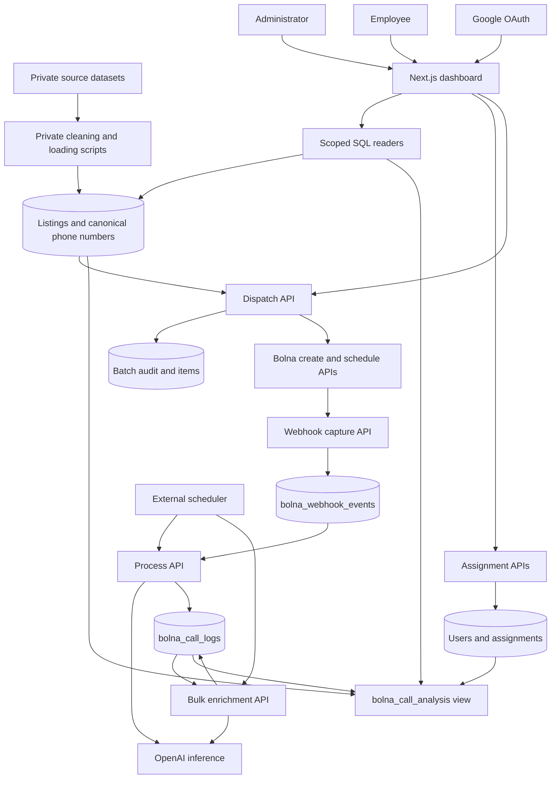
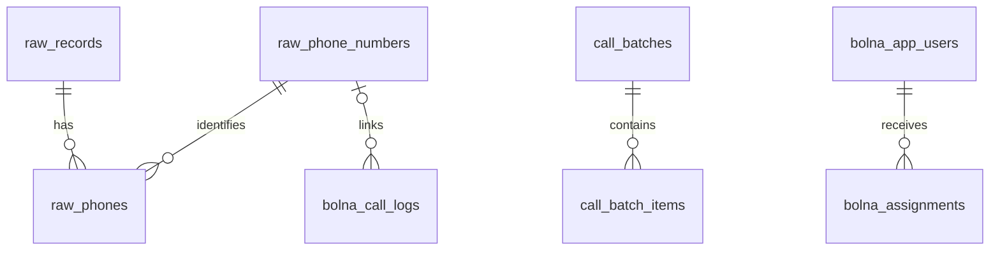
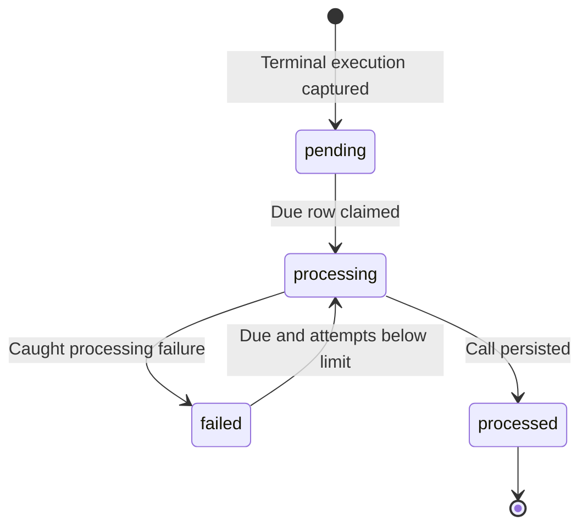

# Bolna Processing

Internal warehouse sourcing and verification application. It brings together a
master listing dataset, AI phone calls through Bolna, transcript analysis through
OpenAI, and employee follow-up in one dashboard.

There are two work channels:

- **AI calling:** an administrator selects listings, schedules a Bolna batch, and
  reviews the resulting calls and inferred property details.
- **Human verification:** an administrator assigns a listing or an existing AI
  call to an employee, who records the outcome and whether the warehouse was
  added to the business database.

This document describes the implementation in this checkout. It does not assert
that a particular migration, scheduler, or deployment is active in production.
Those are environment-specific operational facts.

## Contents

- [Architecture](#architecture)
- [Repository map](#repository-map)
- [Data model and ownership](#data-model-and-ownership)
- [Call capture and processing](#call-capture-and-processing)
- [Inference and classification](#inference-and-classification)
- [Dispatch and scheduling](#dispatch-and-scheduling)
- [Assignments and access control](#assignments-and-access-control)
- [Dashboard and query design](#dashboard-and-query-design)
- [Local setup](#local-setup)
- [Configuration](#configuration)
- [Database management](#database-management)
- [HTTP interface](#http-interface)
- [Deployment and operations](#deployment-and-operations)
- [Validation](#validation)
- [Current limitations](#current-limitations)

## Architecture

The application is a single Next.js service. Server components query Postgres
directly; route handlers provide authenticated mutations, exports, webhook
capture, and worker entry points. There is no separate always-running worker:
a scheduler invokes HTTP endpoints to perform bounded batches of work.



| Component | Implementation | Design reason |
|---|---|---|
| Web application | Next.js 15 App Router, React 19, TypeScript | Keep dashboard rendering and server operations in one deployment. |
| Runtime | Node.js route handlers; Vercel-oriented configuration | Database connections, crypto, and external API calls stay on the server. |
| Runtime database access | Parameterized SQL through `pg` | Keep explicit control over queue locking, joins, upserts, and filtered exports. |
| Database | Supabase Postgres | Store listings, call history, workflow, and the processing queue together. |
| Schema tooling | Prisma 7 plus supplemental SQL | Model tables and supported indexes; retain SQL for objects outside that model. Prisma Client is not used at runtime. |
| Calling | Bolna batch API and execution webhooks | Separate outbound scheduling from asynchronous call results. |
| Inference | OpenAI SDK with a strict JSON response schema | Extract consistent fields from noisy Hindi/Hinglish transcripts. |
| Validation | Zod and Vitest | Validate external payloads and test consequential rules without live services. |

The operating model is an internal tool with bounded batches. Using Postgres as
the queue avoids another service, but database availability, connection limits,
and recovery from interrupted requests remain application concerns.

## Repository map

```text
bolna-processing/
├── src/app/
│   ├── api/                    # Webhooks, workers, auth, exports, mutations
│   └── dashboard/
│       ├── calls/              # AI call analytics
│       ├── raw/                # Master dataset and calling selection
│       ├── my/                 # Personal manual-call and AI-review work
│       ├── assignments/        # Admin assignment history
│       └── team/               # Account and role management
├── src/lib/
│   ├── db.ts                   # Shared Postgres pool
│   ├── bolna.ts                # Execution validation and normalization
│   ├── openai.ts               # Prompts, response schemas, inference version
│   ├── inference.ts            # Eligibility and result-to-column mapping
│   ├── enrich.ts               # Shared inference persistence
│   ├── queue.ts                # Phone deduplication, categories, CSV generation
│   ├── dispatch.ts             # Batch assembly and live Bolna transport
│   ├── routing.ts              # Region rules and schedule calculation
│   ├── auth.ts / users.ts      # Sessions, access lookup, accounts
│   ├── scope.ts                # Assignment visibility predicates
│   ├── assignments.ts          # Assignment writes and history readers
│   ├── calls.ts / raw.ts       # Scoped grid, export, and selection readers
│   ├── personal-work.ts        # Employee work lists and totals
│   └── autosave.ts             # Serialized client save state machine
├── aws/                        # Historical scheduler integration notes
├── prisma.config.ts            # Schema tooling connection configuration
├── .env.example                # Starting configuration; see corrections below
└── package.json
```

The following directories are intentionally gitignored and may exist only in an
internal checkout: `prisma/`, `sql/`, `scripts/`, `rawdata/`, `cleandata/`,
`exports/`, and `.claude/skills/`. They contain private schema, pipeline, or source
material. A normal clone includes the application but **cannot provision a full
database or run the private maintenance scripts by itself**.

The browser evaluation project is a separate package at `../bolna-eval/` in this
workspace. It is not an application dependency.

## Data model and ownership

### Entity relationships



These are the principal foreign-key relationships. Additional **logical** links
are separate: webhook and call-log IDs share an execution UUID;
`bolna_call_logs.batch_id` matches `call_batches.bolna_batch_id`; assignment
`entity_id` identifies either a listing or a call. Those links are not all
foreign keys.

| Relation | One row represents | Important fields or constraints |
|---|---|---|
| `bolna_webhook_events` | One captured execution | Execution UUID primary key; original JSON; queue state, retry count, due time, error. |
| `bolna_call_logs` | One normalized call | Same execution UUID; call facts, inference, human workflow, canonical `phone_id`. |
| `bolna_call_analysis` | One call, as a SQL view | Effective availability, follow-up segment, source matches, current assignment. |
| `raw_records` | One source listing | UUID plus unique `(source, source_record_id)`; searchable columns and JSON metadata. |
| `raw_phone_numbers` | One canonical number | Unique `phone_last10`; numeric surrogate `phone_id`; formatted phone. |
| `raw_phones` | One listing-to-number association | Unique `(master_id, phone_id)`; `is_primary`. |
| `call_batches` | One dispatch attempt | Creator, scheduled time, state, filter snapshot, exclusion counts, Bolna batch ID. |
| `call_batch_items` | One number selected for a batch | Batch FK; listing ID and contact data captured at dispatch time. |
| `bolna_app_users` | One account | Email primary key; name, admin/employee role, active flag. |
| `bolna_assignments` | One assignment episode | Polymorphic entity ID, assignee, brief, state, result, remarks, warehouse reference. |

### Why phone numbers connect calls to listings

A listing can have several numbers, and a number can appear on several listings.
Joining calls directly to listings would duplicate calls and imply a certainty
the data does not provide. The canonical phone table provides a shared identity,
while `raw_phones` preserves the many-to-many listing relationship.

Numbers are compared using their last ten digits. The worker uses `from_number`
for inbound calls and `to_number` otherwise, ensures a canonical row exists,
and writes its `phone_id` onto the call. Ten-digit numbers receive a `+91`
formatted value. Missing numbers resolve to an empty-string canonical key. This
normalization assumes an Indian dataset; it is not international phone parsing.

`bolna_call_logs.phone_last10` is a generated database column. The surrogate key
supports the FK without coupling it to updates of a generated string. The current
Prisma model permits a null `phone_id`, although the normal worker path resolves
one before inserting a call.

### Listing schema and ingestion decisions

Common operational fields such as owner, area in square feet, city, state,
address, and contact type have ordinary columns. Less consistent source
attributes live in `metadata` JSONB. This keeps common queries stable while
allowing source adapters to preserve extra fields without a migration per key.

The private cleaner normalizes area units, splits phone cells, harmonizes metadata
keys, and retains selected originals such as `area_sqft_raw` and `owner_name_raw`
when cleaning them. It removes known junk metadata, so it is not an archival copy
of every source byte. Original datasets remain a separate artifact.

State resolution follows curated city mappings, optional model-assisted gap
filling, and canonical-state validation. Known city mappings override conflicting
source states. A number reused on at least three listings is the basis for the
`probable broker` heuristic; an unflagged contact is presented as an owner.
Neither label independently verifies ownership.

Preserve listing UUIDs during refreshes. Natural-key upserts can retain them;
truncating and recreating listings can orphan assignments and historical batch
references, which have no listing FK to repair them.

### Separate machine facts from human work

| Data | Writer | Reason for separation |
|---|---|---|
| Call facts and original payload | Processing worker | Trace results back to the execution. |
| Model verdict, extracted fields, inference JSON/version/model | Worker and enrichment endpoints | Recompute analysis independently of employee results. |
| `m_call_status`, `called_by`, `added_to_db`, `wh_id` on a call | Scoped call PATCH endpoint | Retain call-analytics workflow through reprocessing. |
| Outcome, remarks, `added_to_db`, `wh_id` on an assignment | Assignee or administrator | A manual call has no Bolna log row; its deliverable belongs to its assignment. |

The two `added_to_db`/`wh_id` pairs are independent and are not automatically
synchronized. Setting them records business work; this app does not itself create
a warehouse in an external business database.

The database is shared with another application that owns unprefixed relations
including `calls`, `contacts`, `assignments`, and `employees`. Follow the established
`bolna_`/`raw_` namespaces for new tables and preserve unrelated models during
schema changes.

## Call capture and processing

Source: [webhook handler](src/app/api/bolna-webhook/route.ts),
[execution adapter](src/lib/bolna.ts), and
[processing worker](src/app/api/process/route.ts).

### Capture is the durability boundary

`POST /api/bolna-webhook` authenticates, parses JSON, validates the fields the app
uses, and inserts the original payload. Zod allows additional fields so a new
provider field does not break ingestion. Telephony duration accepts strings or
numbers and is normalized to whole seconds later.

Only these terminal statuses are captured:

```text
completed, failed, busy, no-answer, canceled, stopped,
error, balance-low, call-disconnected
```

Non-terminal events receive HTTP 200 and are ignored. Invalid JSON receives 400,
invalid payloads 422, and failed authentication 401. A database insert failure
returns 500 so the sender can retry. Capture makes no OpenAI or Bolna API calls.

The insert uses `ON CONFLICT (id) DO NOTHING`. **The first captured terminal
payload wins.** A later delivery with the same execution ID does not refresh the
stored payload, even if its facts changed. Historical backfill uses the same
policy.

### Postgres acts as the job queue



A worker claims due `pending`/`failed` rows inside a transaction using
`FOR UPDATE SKIP LOCKED`, marks them `processing`, commits, and processes its
batch sequentially. Releasing the transaction before inference avoids holding
row locks during external calls. Overlapping process runs can claim different
events.

On a caught processing failure, the row becomes `failed`, `attempts` increments,
and the next attempt is delayed by:

```text
min(2 ^ attempts, 60) minutes
```

The first retry waits two minutes. Rows stop being eligible when `attempts`
reaches their stored `max_attempts`, whose schema default is 8. Error text is
retained, truncated to 1,000 characters. A partial due-time index supports the
worker's selection query.

### Idempotency protects stored results

Call logs use the execution UUID as their primary key. On conflict, the worker
updates status, transcript, context, raw payload, phone linkage, and processing
time. Inference fields change only if that run produced inference. The worker
ORs the `enriched` flag and preserves the greatest inference version.

It does not update every original call fact on conflict: cost, duration,
recording URL, and several other fields are currently insert-only in this upsert.
Human workflow fields are excluded entirely.

The log write and queue acknowledgement are separate queries. Replaying after a
successful log write is safe for row identity, but can repeat an OpenAI request.
This is duplicate-resistant storage, not exactly-once external execution.

### Failure boundaries

An OpenAI exception is caught separately: the worker still stores the call,
leaves new inference absent, and marks the event processed. A later enrichment
pass can recover analysis. Database or normalization failures use event retries.

An interrupted function is different from a caught exception. There is no lease
timestamp or stale-claim recovery: events can remain `processing` after a timeout
or crash. They need operator reconciliation before being requeued.

## Inference and classification

Source: [prompts and schemas](src/lib/openai.ts),
[eligibility rules](src/lib/inference.ts), and
[shared inference writes](src/lib/enrich.ts).

### Business meaning of the verdict

Inference version **2** asks whether the owner has warehouse or commercial space
available. An alternative property offered during the call counts as available;
so does confirmed availability followed by a callback request. A greeting alone
does not count as confirmation.

The result contains `availability` (`Available`, `Unavailable`, `Unclear`),
`built_up_area_sqft`, `city_area`, `expected_rent`, `possession`, `confidence`, and
short explanatory `notes`. Area and rent remain strings; rent preserves its unit.
Unknown details use empty strings. Low confidence sets `needs_review`.

Strict JSON-schema output constrains response shape, not factual correctness.
Empty responses and parsing/API errors can still fail. Near-empty transcripts
return a deterministic low-confidence `Unclear` result without an API request.

### Eligibility and versioning

Automatic property inference requires all three conditions:

1. Status is `completed` or `call-disconnected`.
2. `total_cost` is strictly greater than `INFERENCE_MIN_COST_CENTS`, default
   `0.04`, using the application's interpretation of Bolna cost units as cents.
3. The transcript contains non-whitespace text.

Bulk enrichment additionally selects only unenriched calls or calls with an
older `inference_version`. It orders by cost descending and uses bounded
concurrency. Bump `INFERENCE_VERSION` when changing the prompt or result schema
so historical rows become eligible again.

`ENABLE_ENRICHMENT=false` disables only inline inference in `/api/process`.
`/api/enrich`, `/api/district`, and per-call inference remain callable. The
per-call endpoint checks ownership but does not enforce automatic eligibility
or version gates; it is a manual re-inference path. The dashboard's `can_enrich`
SQL mirrors the automatic gate and must stay aligned with it.

### Classification belongs in a view

`bolna_call_analysis` applies deterministic rules over stored facts:

- `busy` and `no-answer` produce the legacy label `dead number - do not call`
  and segment `no_reach`. This means the call did not reach the recipient; it
  does not establish that a number is permanently invalid.
- Connected calls use the model verdict, defaulting to `Unclear` when absent.
- Other statuses default to `Unclear`. Hangup reason/status then selects
  `followup_hungup`, `followup_silent`, `followup_voicemail`, `followup_retry`, or
  `followup_other`. Resolved availability has an empty segment.

Updating the view reclassifies history without paying for inference again. The
model's original verdict remains in `llm_availability` for human comparison.

The optional district endpoint selects calls whose source recipient `area` is
SQL null and whose `inferred_district` is null, provided transcript/locality signal
exists. An undetermined result is stored as `''` to avoid reselection. This is a
separate, unversioned pass; its stored district is not currently projected by
`bolna_call_analysis` into the main call reader.

## Dispatch and scheduling

Source: [queue utilities](src/lib/queue.ts),
[batch assembly and transport](src/lib/dispatch.ts),
[routing](src/lib/routing.ts), and
[dispatch handler](src/app/api/raw/dispatch/route.ts).

**Dispatch is live: scheduling a batch places real phone calls.** The API requires
an admin session and `confirm: true`, and the UI has a confirmation step.

### Selection is reconstructed on the server

The browser sends record IDs and a filter snapshot. The server fetches current
contact data from Postgres and rebuilds the callable set; client-supplied phone
numbers are never used. The snapshot is stored for audit, not reapplied as a
second dispatch filter.

The pure `assembleBatch()` helper narrows candidates in this order:

```text
deduplicate number → optional category exclusions → region holdback
                   → already queued exclusion → non-empty phone
```

Its accounting reports the candidate count after deduplication and rows removed
at each stage. Already-called categories are `dead`, `unclear`, `available`, and
`unavailable`; an empty category means never called. Excluding a past outcome is
an operator choice, rather than a blanket prohibition on calling again.

The UI removes excluded categories before sending IDs. The route calls
`assembleBatch(rows)` without category arguments, so its persisted exclusion
counts describe only the submitted subset. It still enforces deduplication,
region holdback, queued-number checks, and phone presence server-side.

### Routing and provider contract

The routing rule holds back Tamil Nadu, Kerala, and Karnataka from the configured
Hindi agent. Comparison ignores case and surrounding spaces. Unknown or empty
states pass this rule; the app does not infer a recipient's language. There is
no English-agent route yet.

The transport implements two requests: create a batch by uploading a multipart
CSV, then schedule its returned ID. Its provider assumptions are encoded in
[routing.ts](src/lib/routing.ts) and [dispatch.ts](src/lib/dispatch.ts):

- CSV columns are `name,property_type,contact_number,area`. Property type is
  `warehouse`; `area` is the listing city, not square footage.
- CSV output uses a UTF-8 BOM, CRLF line endings, and quoting for commas, quotes,
  and newlines.
- The filename uses the most frequent cities and the scheduled date in IST.
- The earliest scheduling slot is a ten-minute UTC boundary with at least two
  minutes of headroom, formatted with a numeric `+00:00` offset.
- The create request asks Bolna for three retries at 30, 60, and 120 minutes.
  Optional `BOLNA_FROM_NUMBER` supplies a caller-number override.

### Persist the attempt before contacting Bolna

The route writes a `sending` batch and bulk-inserts items with `unnest`, then
contacts Bolna. On success it stores the provider batch ID and marks `scheduled`.
On a caught provider error it marks `failed` and returns HTTP 502 with the local
batch ID. Error text is returned, but is not stored on the batch row.

Numbers in `sending` or `scheduled` batches are excluded from later selections;
`failed` batches do not block. Recent batch activity joins received call logs
through the provider batch ID.

These checks reduce repeat dispatches but are not a transactional reservation.
Concurrent requests can select the same number, and a lost response can leave
local state different from Bolna's state. The UI treats unsuccessful confirmation
as uncertain and directs the operator to Recent batches before trying again.

## Assignments and access control

Source: [auth](src/lib/auth.ts), [scope](src/lib/scope.ts),
[assignment persistence](src/lib/assignments.ts), and
[user management API](src/app/api/users/route.ts).

### One assignment table for both channels

An assignment targets `entity_type = 'record'` for manual calling or `'call'`
for AI-call follow-up. A partial unique index permits at most one `open`
assignment per `(entity_type, entity_id)`. Assignment ownership is represented
without duplicating the same fields on both entity tables.

States are `open`, `done`, and `dropped`. Reassignment closes another person's
open assignment and creates a new one; open work already owned by the target
is retained. Without `reassign: true`, existing open assignments are skipped and
reported. Completed rows remain history and do not prevent new assignments.

Bulk assignment accepts explicit IDs or approved filter fields. For filtered
assignment, the server resolves the set and excludes phone-less raw records.
The target must be an active account; a request is capped at 20,000 IDs.

Assignees record outcome, remarks, warehouse reference, and completion. The
current UI/API no longer records attempt counters; `attempts` and
`last_attempt_at` remain legacy schema columns. Human outcomes reuse the AI
vocabulary to support comparison without overwriting the AI verdict.

### The database grants access

Google OAuth verifies identity and email verification. `bolna_app_users` then
decides access and role on subsequent requests:

| Account state | Result |
|---|---|
| Active row | Admit with the stored role. |
| Inactive row | Deny. |
| No row | Deny, except for the bootstrap rule. |
| Database lookup fails | Deny access. |

`ADMIN_EMAILS` bootstraps an email **only when that email has no user row and no
active admin exists**. Existing inactive or employee rows take precedence; this
variable does not promote or reactivate them. Create an active admin row through
Team after first sign-in. Once an active admin exists, bootstrap cannot admit
additional accounts. `ALLOWED_EMAILS` is unused.

User-management guards reject self-demotion/self-deactivation and removing the
last active admin. Account state is rechecked per request, so access changes
require neither a redeploy nor a new session cookie.

### Session and authorization boundaries

`bp_session` contains `<email>.<base64url HMAC-SHA256(email)>`, verified with a
constant-time signature check. It is HTTP-only, `SameSite=Lax`, Secure in
production, and given a 30-day browser lifetime. The signature contains no
timestamp; the token has no independent server-side expiry. Rotating the signing
secret invalidates sessions.

OAuth uses a short-lived state cookie. Callback URLs derive from forwarded
protocol/host headers and the request host. `GOOGLE_REDIRECT_URI` is not read.
Register the actual callback URI emitted for each environment with Google.

There is no authentication middleware. Pages explicitly call `requireUser()` or
`requireAdmin()`; APIs call their corresponding session guards. Every new route
must add its own guard. React `cache()` deduplicates access resolution within a
request rather than caching permissions across requests.

Employee entity visibility uses an `EXISTS` predicate against assignments whose
state is not `dropped`. Done work remains visible and editable. Scoped call and
assignment updates include ownership in the SQL `WHERE`; inaccessible rows return
404. Per-call inference uses a separate ownership check before its work.

Application predicates enforce employee isolation, not per-user Postgres RLS.
Reuse scoped entity readers; history and personal-work readers must receive the
employee's assignee filter explicitly. A direct pooled query does not inherit
the browser user's permissions.

Administrators can switch to Employee view through `bp_view`, narrowing their
effective role and data access. Switching back is allowed only while the current
database account remains an admin; the preference cannot grant admin access.

## Dashboard and query design

### Pages

| Page | Audience | Purpose |
|---|---|---|
| `/` | Public | Google sign-in and access errors. |
| `/dashboard` | Signed-in users | Role-aware navigation and workload counts. |
| `/dashboard/raw` | Admin | Search listings, export, assign, and prepare calling batches. |
| `/dashboard/calls` | Signed-in users; scoped for employees | Call results, transcripts, inference, workflow edits. |
| `/dashboard/my` | Signed-in users, including admins | Own manual-call and AI-review assignments, independently paginated. |
| `/dashboard/assignments` | Admin | Assignment history and human/AI comparison. |
| `/dashboard/team` | Admin | Accounts, roles, active access, workload. |

### Shared query rules

[calls.ts](src/lib/calls.ts) and [raw.ts](src/lib/raw.ts) each have a common filter
builder for grids, exports, and ID resolution. Employee scope is added before
user filters. User values are parameterized, and existence predicates avoid
multiplying entities with several phone or assignment rows.

Search uses up to six whitespace-separated terms. Each term must match a
searchable column through substring matching or `pg_trgm.word_similarity` above
0.5 on selected text columns. Similarity is evaluated per column so a long
concatenated record does not dilute a short name. Grids highlight substring
matches using the same terms.

The call view attaches source matches with `LEFT JOIN LATERAL`. Counts and source
names cover all matches; the JSON array includes at most 12. Ranking prefers
unflagged contacts, primary-phone matches, and newer ingestion times. This bounds
response size and keeps one row per call, but the representative listing does
not prove which property was discussed. Call source filters search all matched
sources; fields such as state use the representative match.

Calls default to 25 rows per page, raw listings and assignment history to 50,
and personal work to 25 per channel. Filter-option queries have a ten-minute
cache, so current records can precede new dropdown values.

Filtered raw exports cap at 100,000 rows. Filter-based calling selection and bulk
assignment cap at 20,000 and report truncation. Filtered call exports have no row
cap; the call export endpoint limits explicit ID selections to 1,000. Both CSV
endpoints build responses in memory. Shared readers preserve scope and ordering,
but these ceilings mean exports are not universally unlimited grid copies.

### Server rendering with focused client components

Async server components fetch and render tables. Client components provide
selection, dialogs, filtering navigation, editing, and delegated keyboard and
clipboard behavior. This keeps database access on the server without moving the
entire table into a client-side grid library.

Admin grids favor dense scanning, frozen identifying columns, column resizing,
hide/show controls, and collapsible groups. My Work favors readable context and
visible form controls. Detail dialogs fetch scoped entity data and assignment
history when opened, keeping long transcripts out of the initial table layout.

URL query parameters hold filters and pagination. Saved views use `localStorage`,
scoped by account and route; column/group preferences use route-based storage.
They are browser preferences, not shared database objects.

### Autosave protects edits through slow and failed requests

[Autosave](src/lib/autosave.ts) permits one in-flight write per mounted editor,
compares later edits against the last confirmed value, and follows up after edits
during a request. Failed fields require explicit retry. A lost response is an
uncertain write, rather than proof that nothing saved.

[useAutosave](src/app/dashboard/useAutosave.tsx) recovers unsaved drafts from
tab-scoped `sessionStorage` without sending them automatically. The dashboard
shows save/error state and guards navigation while changes are pending. This
handles client request ordering; there is no database revision check for
conflicting edits from different tabs or users.

## Local setup

### Prerequisites

- Node.js 22.12+ within the 22.x line, or another version supported by the installed
  dependencies. The current Prisma package declares `^20.19 || ^22.12 || >=24.0`;
  private scripts also use Node's environment-file support.
- npm and an existing compatible Postgres database with TLS enabled.
- Google OAuth credentials and an active account or valid bootstrap email for
  dashboard access.
- Bolna credentials for dispatch/backfill and an OpenAI key for inference when
  those features are needed.

### Run against an already provisioned database

From `bolna-processing/`:

```bash
npm ci
cp .env.example .env.local
```

Populate `.env.local` using the configuration tables below. Then:

```bash
npm run dev
```

The app serves on `http://localhost:3000`. In another terminal:

```bash
curl --fail-with-body http://localhost:3000/api/health
```

Health checks database access and the event relation, not the complete dashboard
schema. The database also needs `bolna_call_analysis`, user/assignment tables,
and required extensions. First sign-in does not auto-create a user row: a
bootstrap admin should create their own active admin row in Team.

For a fresh database, obtain the private schema artifacts first and follow
[Database management](#database-management). The app does not apply migrations
at startup or during `next build`.

## Configuration

Use [.env.example](.env.example) as a starting point. It is incomplete and includes
legacy settings; source behavior below takes precedence. Keep real credentials
in environment configuration, not committed files.

### Connections and authentication

| Variable | Requirement/default | Actual use |
|---|---|---|
| `DATABASE_URL` | Required by the app | Runtime Postgres connection, normally through the Supabase pooler. |
| `DIRECT_URL` | Required for Prisma commands | DDL/session-capable connection; no `DATABASE_URL` fallback in `prisma.config.ts`. Private Node scripts prefer it when present. |
| `SHADOW_DATABASE_URL` | Optional | Disposable schema-replay database for Prisma operations that need one. |
| `BOLNA_WEBHOOK_SECRET` | Required for capture | Query `token` or `x-webhook-secret` header. |
| `PROCESS_SECRET` | Required for worker endpoints | Bearer header or query `token` on process/enrich/district. |
| `GOOGLE_CLIENT_ID`, `GOOGLE_CLIENT_SECRET` | Required for OAuth | Google identity flow. |
| `SESSION_SECRET` | Set explicitly | HMAC key; code falls back to `PROCESS_SECRET`, then `GOOGLE_CLIENT_SECRET`. |
| `ADMIN_EMAILS` | Optional comma-separated list | First-admin bootstrap, subject to the rules above. |
| `ENFORCE_BOLNA_IP` | `false` | Exact string `true` enables a source-IP check. |
| `BOLNA_WEBHOOK_IP` | `13.203.39.153` in code | Expected first `x-forwarded-for` value when enabled; confirm for the deployment. |

[db.ts](src/lib/db.ts) reuses one pool per warm Node process, with at most six
connections and ten-second idle/connect timeouts. It strips `sslmode`,
`pgbouncer`, and `connection_limit` URL parameters and sets
`ssl: { rejectUnauthorized: false }`. TLS is used, but certificate-chain
verification is disabled. A local test database must support TLS too.

Runtime and schema tooling use separate URLs. The Prisma config describes
transaction pooling for the app and a session-pooler connection for DDL; the
template instead shows a session-pooler runtime URL. The app does not enforce a
specific pooler port. Configure each URL for its purpose rather than assuming
the template describes the deployed connections.

### Inference and worker tuning

| Variable | Code default | Actual use |
|---|---|---|
| `OPENAI_API_KEY` | None | Required when inference reaches OpenAI. |
| `OPENAI_MODEL` | `gpt-4o` | Shared property/district model. The template sets `gpt-4o-mini`, overriding this fallback. |
| `ENABLE_ENRICHMENT` | Enabled unless exactly `false` | Inline inference in `/api/process` only. |
| `INFERENCE_MIN_COST_CENTS` | `0.04` | Strict lower cost threshold for automatic property inference. |
| `PROCESS_BATCH_SIZE` | `5` | Sequential events per process request. |
| `ENRICH_BATCH_SIZE` | `24` | Calls per bulk enrichment request. |
| `ENRICH_CONCURRENCY` | `4` | Concurrent tasks within bulk enrichment and district requests. |
| `DISTRICT_BATCH_SIZE` | `24` | Calls per district request. |
| `CALLED_BY_OPTIONS` | Built-in names when absent | Comma-separated workflow dropdown values; an explicit empty value yields no options. |

Use positive integer batch sizes/concurrency. Route handlers parse these values
directly without a configuration-validation layer.

### Dispatch and private scripts

| Variable | Use |
|---|---|
| `BOLNA_API_KEY` | Batch transport and historical execution reads. |
| `BOLNA_AGENT_ID` | Agent for live dispatch. |
| `BOLNA_FROM_NUMBER` | Optional caller-number override. |
| `BACKFILL_AGENT_IDS` | Comma-separated agents for the private backfill script. |
| `BACKFILL_FROM`, `BACKFILL_TO` | UTC ISO date bounds; end defaults to the current time. |
| `DRAIN_URL`, `PROCESS_URL` | Drain-script URL fallback when no positional URL is given. The npm drain/enrich scripts supply localhost URLs explicitly. |

`MAX_ATTEMPTS` in the template is **not read by the current worker**. Retry limits
come from each event's `max_attempts` column. `GOOGLE_REDIRECT_URI` and
`ALLOWED_EMAILS` are also unused.

## Database management

This section requires the private `prisma/` directory. Schema tooling lives in
[prisma.config.ts](prisma.config.ts); runtime queries use `pg`.

For a schema change, edit the model and inspect the proposed database diff:

```bash
npm run db:diff
```

After reviewing it against the intended database, the existing update workflow is:

```bash
npm run db:push
npm run db:post-push
```

`prisma/schema.prisma` describes tables and supported indexes.
`prisma/post-push.sql` supplies `pg_trgm`, `pgcrypto`, role/entity/state/outcome
CHECK constraints, and the current `bolna_call_analysis` view. The post-push step
is required: table synchronization alone does not make the dashboard schema
complete. Its current SQL drops/recreates the named checks and view; inspect any
execution failures.

Important maintenance decisions:

- **Introspection overwrites the model.** `npm run db:pull` refreshes from the
  selected database and can remove models not yet applied. Preserve pending
  schema work before pulling.
- **Generated columns need SQL care.** Prisma introspection represents
  `phone_last10` as a generated default expression. Preserve its generated-column
  definition in replay SQL; a naive generated diff may not reproduce it.
- **Partial indexes are intentional.** The schema enables `partialIndexes` for
  due-event and assignment-exclusivity indexes, among others.
- **Connection handling differs.** Prisma requires `DIRECT_URL` and rewrites
  `sslmode=require` to `prefer` for the existing pooler compatibility workaround.
  This is separate from the runtime pool's explicit TLS configuration.
- **The database is shared.** Review unrelated models and every proposed drop.
  Do not initialize an already populated shared database with the baseline.

`prisma/migrations/` retains baseline and later SQL for rebuilding an empty test
database. The browser harness replays those files, then applies `post-push.sql`.
Keep replay SQL and schema models aligned when changing columns. Fresh setup
should use this reviewed SQL path to preserve generated columns and supplemental
objects rather than assuming `db:push` alone is a complete bootstrap.

`sql/` is historical. `npm run db:init` requires private scripts and replays legacy
numbered SQL; it is not the current complete setup path. There is no `db:migrate`
npm script. `db:status` inspects Prisma's migration ledger, which does not record
changes applied through `db:push`.

## HTTP interface

“Scoped session” means an active signed-in user with assignment-limited access
when acting as an employee. Admin guards generally return 403 for anonymous and
non-admin requests; ordinary session guards return 401.

| Method | Route | Authorization | Purpose |
|---|---|---|---|
| POST | `/api/bolna-webhook` | Webhook secret; optional IP check | Capture a terminal execution. |
| GET, POST | `/api/process` | Process secret | Claim and process due events. |
| GET, POST | `/api/enrich` | Process secret | Infer eligible missing/stale call analysis. |
| GET, POST | `/api/district` | Process secret | Fill missing inferred districts. |
| GET | `/api/health` | None | Database connectivity and pending/failed event count. |
| GET | `/api/raw/queue` | Admin | Resolve filtered calling candidates and counts. |
| POST | `/api/raw/dispatch` | Admin; `confirm: true` | Create and schedule a live batch. |
| GET | `/api/batches` | Admin | Latest 20 batches and received-result counts. |
| GET | `/api/raw/export` | Scoped session | Selected or filtered listing CSV. |
| GET | `/api/calls/export` | Scoped session | Selected/filtered call CSV. |
| PATCH | `/api/calls/[id]` | Scoped session | Edit `call_status`, `called_by`, `added_to_db`, `wh_id`. |
| POST | `/api/calls/[id]/enrich` | Scoped session | Manually infer one call. |
| GET | `/api/details/[entity]/[id]` | Scoped session | Entity detail and up to 50 history rows; entity is `call` or `record`. |
| POST | `/api/assignments` | Admin | Assign explicit IDs or a filtered entity set. |
| PATCH | `/api/assignments/[id]` | Assignee or admin | Edit outcome, remarks, state, `added_to_db`, `wh_id`. |
| DELETE | `/api/assignments/[id]` | Admin | Mark an open assignment dropped; retain history. |
| GET, POST | `/api/users` | Admin | List or upsert accounts. |
| POST | `/api/view-mode` | Current database admin | Switch effective admin/employee view. |
| GET | `/api/auth/google` | None | Begin OAuth. |
| GET | `/api/auth/google/callback` | OAuth state and verified identity | Complete sign-in after account authorization. |
| POST | `/api/auth/logout` | No session required | Clear session and view preference. |

Worker GET requests have the same side effects as POST. Prefer authenticated POST
from schedulers. Process/enrich/district responses include `claimed`, `succeeded`,
and `failed`; process adds per-event results. HTTP 200 can contain failed items,
so inspect counters rather than only the status code.

Calls and raw records use UUIDs. Assignment IDs are numeric identifiers returned
as strings by `pg` for bigint columns.

## Deployment and operations

### Deploy the service

Set the project root to `bolna-processing` when deploying this combined workspace.
The application uses `npm run build` and `npm run start`; for Vercel, set variables
in the project environment configuration.

Provision the schema separately, register the deployed Google callback, and
configure Bolna's execution webhook to send to:

```text
https://<app-host>/api/bolna-webhook?token=<BOLNA_WEBHOOK_SECRET>
```

The header alternative is `x-webhook-secret`. IP enforcement trusts the first
forwarded IP header, so its meaning depends on the deployment's proxy behavior
and expected sender address.

Process and per-call enrichment declare `maxDuration = 60`; bulk enrichment and
district declare `300`. Effective runtime limits depend on host configuration.
Size batches so requests finish within those limits.

### Schedule bounded worker runs

Private `sql/manual/006_cron_enrich.sql` defines a polling design:

| Job | Cadence in the script | Target |
|---|---|---|
| `drain-process` | Every two minutes | `POST /api/process` |
| `enrich-analysis` | Every ten minutes | `POST /api/enrich` |

It uses `pg_cron` and `pg_net`, with `PROCESS_SECRET` in Supabase Vault. Replace
both the deployment URL and secret placeholder for the target environment.
Re-running the create-if-missing secret block does not rotate an existing Vault
secret. Earlier `005_cron.sql` includes a different trigger/backstop design; do
not apply both templates indiscriminately.

Polling keeps capture independent of outbound scheduler HTTP and limits how much
work webhook bursts start. It adds scheduling delay and does not guarantee
two-minute completion during a backlog. Verify scheduler installation and HTTP
delivery independently of application deployment.

Any scheduler capable of authenticated HTTP POST can drive the endpoints. An AWS
scheduled Lambda can issue that request. Historical options in
`aws/eventbridge-scheduler.md` need provider-specific validation before use.

Unlike `/api/process`, bulk enrichment and district selection have **no row
claim/lock mechanism**. Use one runner per bulk endpoint; overlapping runs may
send the same transcript to OpenAI and incur duplicate work.

### Trigger one processing batch

This example reads local environment configuration without printing the secret.
It processes real due events in whichever database the local app uses:

```bash
node --env-file=.env.local --input-type=module <<'JS'
const response = await fetch('http://localhost:3000/api/process', {
  method: 'POST',
  headers: { Authorization: `Bearer ${process.env.PROCESS_SECRET}` },
});
console.log(response.status, await response.json());
if (!response.ok) process.exitCode = 1;
JS
```

### Historical backfill and re-inference

With private scripts available, configure `BOLNA_API_KEY`, `BACKFILL_AGENT_IDS`,
and `BACKFILL_FROM`, then run:

```bash
npm run backfill
```

The script reads executions per agent in seven-day windows and pages of 50,
queuing terminal executions. It does not place calls. Duplicate IDs are skipped,
allowing a restart without duplicate event rows.

With the local app running, drain due work:

```bash
npm run drain
npm run enrich
```

The helper stops on `claimed = 0`, meaning **nothing eligible now**, not that all
events completed. Delayed failures, exhausted retries, and abandoned `processing`
rows can remain. Persistent bulk enrichment failures can be repeatedly selected
because that endpoint has no per-row backoff.

After changing inference, update the prompt/schema, persistence mapping, database
schema/view, and readers as needed, then increment `INFERENCE_VERSION`. Run one
enrichment loop or let the configured schedule select stale eligible rows.
`ENABLE_ENRICHMENT=false` alone does not stop scheduled bulk inference.

### Inspect queue state and failures

These read-only queries distinguish waiting work from work needing repair:

```sql
select status, count(*) as events
from bolna_webhook_events
group by status;

select id, status, attempts, max_attempts, next_attempt_at, last_error
from bolna_webhook_events
where status = 'failed'
order by next_attempt_at;

select id, received_at, attempts, last_error
from bolna_webhook_events
where status = 'processing'
order by received_at;
```

Fix the cause of failed events and inspect whether retries remain. For abandoned
claims, confirm no worker is still handling the selected IDs before changing
state and due time. `received_at` is capture time, not claim-start time, so it
cannot by itself establish that a worker is stale.

`/api/health` counts all `pending` and `failed` rows, including delayed and
exhausted failures, and excludes `processing`. `ok: true` therefore does not
establish queue progress or working inference credentials.

If Supabase cron is configured, inspect jobs and invocation history:

```sql
select jobname, schedule, active
from cron.job
where jobname in ('drain-process', 'enrich-analysis');

select jobid, status, return_message, start_time, end_time
from cron.job_run_details
order by start_time desc
limit 10;
```

Cron success can mean an asynchronous HTTP request was queued. Check HTTP
responses and application logs as well as SQL invocation results.

### Reconcile an uncertain dispatch

Review Recent batches, application logs, and the provider batch before creating
another attempt. A batch may have been created or scheduled even if the client
saw a timeout or the final database update failed. There is no automated
cross-system reconciliation or cancellation flow in this application.

### Private dataset maintenance

The intended pipeline is `rawdata/` → cleaner → `cleandata/` → loader → Postgres.
The application does not run it. Private Python tooling uses packages such as
pandas and psycopg2 outside npm dependency management.

The local loader still contains an old absolute project root and legacy
`raw_phones` column references. Adapt and validate it against the current
`phone_id` schema in a disposable database before using it as a reload procedure.
`npm run db:init` is not a substitute for that validation.

## Validation

Framework-independent unit tests cover phone normalization and deduplication,
call categories, CSV generation, batch guard ordering, region routing,
schedule/filename calculation, assignment scope, and autosave ordering and
failure recovery.

```bash
npm test
```

Additional local checks for application changes:

```bash
npx tsc --noEmit
npm run build
```

The separate `../bolna-eval/` package exercises a real browser and disposable
TLS-enabled Postgres. It reproduces signed sessions to test authenticated
behavior without Google OAuth and replays the private schema plus post-push SQL.
Coverage includes roles, scoped reads/writes/exports, assignments, schema parity,
and visual/accessibility behavior.

Run that harness from its own directory using its README and package scripts.
Database setup replaces its test container and tests reseed fixtures; keep it
pointed at disposable infrastructure. Run one suite against its shared database
and port, and do not run `next build` in the app checkout while its dev server
uses the same `.next` directory.

Unit and browser tests do not establish that live Bolna credentials, production
cron, or current OpenAI responses work. Verify those integrations in the intended
environment separately.

## Current limitations

These are implementation boundaries, not claims about production incidents:

| Area | Current limit and consequence |
|---|---|
| Reproducible setup | Schema, migrations, and maintenance directories are private. An ordinary clone needs an existing database or those artifacts. |
| Worker recovery | No lease or automatic stale-claim recovery. A terminated worker can strand its claimed batch in `processing`. |
| Corrected execution data | First terminal webhook wins; duplicates do not refresh facts. The call upsert leaves several facts insert-only. |
| Bulk inference | No cross-request claim locks, failure backoff, or global inference-off switch. Overlap can duplicate requests. |
| Dispatch consistency | No request idempotency key, atomic number reservation, or transaction spanning local writes and Bolna. Ambiguous sends need reconciliation. |
| Batch completion | The app writes `sending`, `scheduled`, and `failed` but does not automatically retire completed scheduled batches. Their numbers stay excluded while that state persists. |
| Assignment integrity | Polymorphic entities have no entity FK. Explicit-ID assignment checks UUID shape but not entity existence or phone eligibility; reassignment drop/insert is not one transaction. |
| Assignment transitions | PATCH accepts `dropped` from an assignee as well as an admin, although the dedicated unassign DELETE route is admin-only. |
| Session expiry | Cookie lifetime uses browser expiry; the signed token itself has no expiry timestamp. |
| Concurrent editing | Autosave serializes one editor's requests, but there is no cross-client optimistic concurrency control. |
| Export scale | CSV generation is in memory; filtered call exports are uncapped and raw exports truncate at their ceiling. |
| Entity matching | Last-ten-digit matching and representative listings do not establish property identity. Owner rollups and cross-source listing deduplication are not implemented. |
| Language expansion | One configured agent and a three-state holdback; no multi-agent language routing. |

When extending the system, preserve its boundaries: capture before slow work,
scoped SQL at each access path, human-owned fields outside machine upserts, and
explicit operator confirmation before live dispatch.
